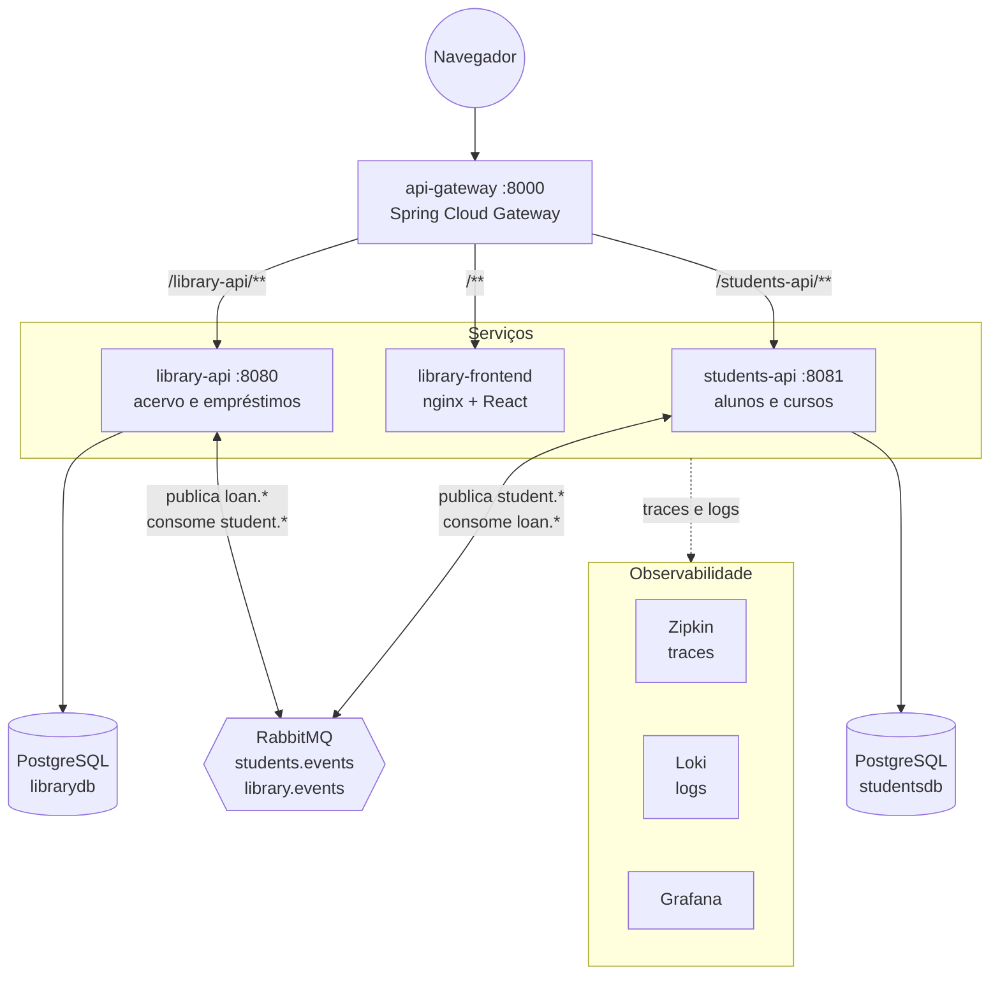
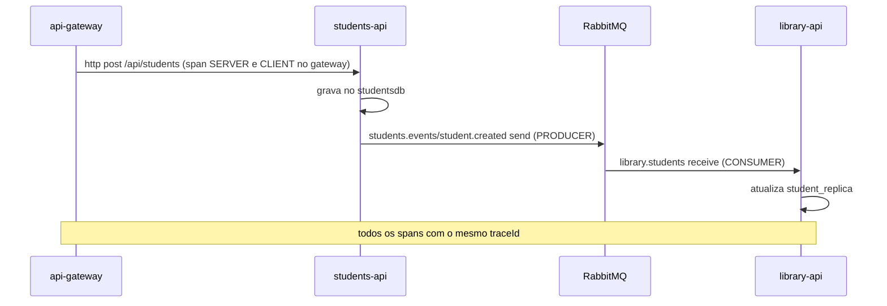
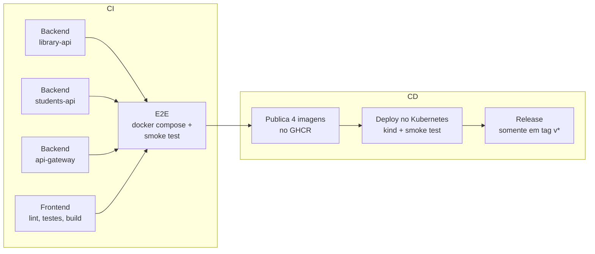

# Biblioteca Aurora - Sistema de Microsserviços

Projeto de Bloco da disciplina **Engenharia de Softwares Escaláveis**. Sistema de gestão de biblioteca construído de forma incremental ao longo de cinco etapas: começou como um monólito Spring Boot e terminou como um conjunto de microsserviços que se comunicam por eventos, rodam em contêineres, são orquestrados pelo Kubernetes, monitorados com logs centralizados e rastreamento distribuído e entregues por um pipeline de CI/CD.

[](https://github.com/gustacassel/gustavo_cassel_PB_TP5/actions/workflows/ci-cd.yml)

| Componente | Papel | Tecnologia |
|---|---|---|
| [`api-gateway`](api-gateway) | Porta de entrada única (front-end e APIs) | Spring Cloud Gateway |
| [`library-api`](library-api) | Acervo, empréstimos e cópia local dos alunos | Spring Boot, Spring Data JPA, Spring AMQP |
| [`students-api`](students-api) | Microsserviço de alunos e cursos | Spring Boot, Spring Data JPA, Spring AMQP |
| [`library-frontend`](library-frontend) | Interface web | React, TypeScript, Vite, nginx |
| RabbitMQ | Message broker dos eventos entre os serviços | RabbitMQ 4 |
| PostgreSQL (x2) | Um banco por serviço | PostgreSQL 17 |
| Zipkin, Loki, Grafana | Rastreamento distribuído e logs centralizados | Micrometer Tracing, Loki4j |

## Evolução do projeto

| Etapa | Entrega |
|---|---|
| **TP1** | Monólito Spring Boot em camadas (controller, service, repository), API REST e front-end React |
| **TP2** | Persistência com JPA e Spring Data, histórico de mudanças (auditoria) e testes da camada de persistência |
| **TP3** | Extração do domínio de estudantes para o microsserviço `students-api`, integrado via Spring Cloud OpenFeign |
| **TP4** | Refatoração para arquitetura orientada a eventos com RabbitMQ ([detalhes](docs/arquitetura-eventos.md)) |
| **TP5** | API Gateway, PostgreSQL, Docker, Kubernetes, monitoramento (Zipkin, Loki, Grafana), CI/CD com GitHub Actions e testes de ponta a ponta |

O histórico de cada etapa está no [CHANGELOG](CHANGELOG.md).

## Sumário

- [Arquitetura](#arquitetura)
- [Domínio](#domínio)
- [Comunicação entre os serviços](#comunicação-entre-os-serviços)
- [Como executar](#como-executar)
- [Implantação com Docker](#implantação-com-docker)
- [Implantação no Kubernetes](#implantação-no-kubernetes)
- [Monitoramento](#monitoramento)
- [CI/CD com GitHub Actions](#cicd-com-github-actions)
- [Testes](#testes)
- [Versionamento](#versionamento)
- [Estrutura do repositório](#estrutura-do-repositório)

## Arquitetura



- O navegador fala **somente com o gateway**. As APIs e o front-end ficam na rede interna (compose) ou como Services internos (Kubernetes).
- As APIs **não se chamam entre si**: toda a comunicação entre elas passa pelo RabbitMQ.
- Cada serviço tem o **próprio banco** (isolamento de domínio).
- O trace de uma requisição atravessa gateway, APIs e RabbitMQ, e cada linha de log carrega o `traceId`.

## Domínio

O sistema é dividido em dois bounded contexts, cada um em um serviço:

| Contexto | Serviço | Agregados | Responsabilidade |
|---|---|---|---|
| **Acervo e empréstimos** | `library-api` | `Book`, `Loan` | Cadastro de livros, empréstimo, devolução, atrasos e histórico. Mantém uma cópia somente leitura dos alunos (`StudentReplica`) para validar empréstimos |
| **Vida acadêmica** | `students-api` | `Student`, `Course` | Cadastro de alunos e cursos, situação acadêmica (ativo, trancado, formado, desligado). Sabe quantos empréstimos ativos cada aluno tem pelos eventos da biblioteca |

Regras de negócio que atravessam os dois contextos, garantidas por eventos:

- Só aluno **ativo** pode pegar livro (validado na cópia local da `library-api`).
- Aluno com **empréstimo ativo não pode ser excluído** (`409` na `students-api`).
- Livro com **empréstimo ativo não pode ser excluído** (`409` na `library-api`).

Os dois serviços mantêm **histórico de mudanças** (datas de criação e alteração com JPA Auditing e uma tabela `audit_log` com o diff campo a campo), consultável em `/api/history`.

## Comunicação entre os serviços

| Fluxo | Exchange (topic) | Routing keys | Consumidor | Padrão |
|---|---|---|---|---|
| Alunos | `students.events` | `student.created`, `student.updated`, `student.deleted` | `library-api` (fila `library.students`) | Publish/subscribe com o estado do aluno no evento |
| Empréstimos | `library.events` | `loan.created`, `loan.returned`, `loan.deleted` | `students-api` (fila `students.loans`) | Notificação de evento |

- Eventos publicados **somente após o commit** (`@TransactionalEventListener(AFTER_COMMIT)`).
- Consumo **idempotente** e tolerante a mensagens fora de ordem (versão do aluno e estado do empréstimo que só avança).
- Com a `students-api` fora do ar, empréstimos continuam funcionando e os eventos esperam na fila.

Catálogo completo, payloads, diagramas de sequência e prós e contras da arquitetura orientada a eventos: [docs/arquitetura-eventos.md](docs/arquitetura-eventos.md).

## Como executar

### Com Docker Compose (recomendado)

Pré-requisito: Docker Desktop.

```bash
docker compose up -d --build
```

Em cerca de 1 minuto os 10 contêineres ficam saudáveis:

| Endereço | O quê |
|---|---|
| http://localhost:8000 | **Sistema** (front-end e APIs, pelo gateway) |
| http://localhost:3000 | Grafana: logs centralizados e traces |
| http://localhost:9411 | Zipkin: traces distribuídos |
| http://localhost:15672 | Painel do RabbitMQ (`library` / `library`) |

Para parar: `docker compose down` (ou `docker compose down -v` para apagar também os dados).

### No Kubernetes (kind)

Pré-requisitos: Docker Desktop, [kind](https://kind.sigs.k8s.io/) e `kubectl`. As portas são as mesmas do compose, então pare o compose antes.

```bash
kind create cluster --config k8s/kind-config.yaml
bash k8s/deploy.sh
```

O sistema fica nos mesmos endereços da tabela acima. Para remover: `kind delete cluster --name biblioteca`.

### Smoke test

Com o sistema no ar (compose ou Kubernetes):

```bash
node scripts/smoke-test.mjs http://localhost:8000
```

### Desenvolvimento local

Cada serviço também roda fora de contêiner (H2 em memória, RabbitMQ do compose):

```bash
docker compose up -d rabbitmq
cd library-api && ./mvnw spring-boot:run      # :8080
cd students-api && ./mvnw spring-boot:run     # :8081
cd api-gateway && ./mvnw spring-boot:run      # :8000
cd library-frontend && npm install && npm run dev   # :5173 (repassa as APIs ao gateway)
```

## Implantação com Docker

Cada componente tem um `Dockerfile` **multi-stage**:

| Imagem | Build | Runtime |
|---|---|---|
| `library-api`, `students-api`, `api-gateway` | `eclipse-temurin:21-jdk` + Maven Wrapper (`package`) | `eclipse-temurin:21-jre`, só o jar, usuário sem privilégios, `-XX:MaxRAMPercentage=75` |
| `library-frontend` | `node:24-alpine` (`npm ci` + `npm run build`) | `nginx:1.29-alpine` servindo os arquivos estáticos, com fallback de rotas do React e `/healthz` |

O [`docker-compose.yml`](docker-compose.yml) define:

- **Healthchecks** em todos os serviços (APIs pelo Actuator: `/actuator/health/readiness`).
- **Ordem de subida** com `depends_on: condition: service_healthy`: bancos e RabbitMQ, depois `library-api` (que cria a fila `library.students`), depois `students-api`, front-end e, por último, o gateway.
- **Configuração por variáveis de ambiente**: `DB_URL`, `DB_USER`, `DB_PASSWORD`, `RABBITMQ_HOST`, `LOKI_URL`, `ZIPKIN_URL` e os endereços que o gateway usa para rotear.
- **Só o gateway exposto** para a aplicação (`8000`); bancos e RabbitMQ também publicam porta para facilitar o desenvolvimento.
- **Volumes** para os dois PostgreSQL, o RabbitMQ e o Loki.

## Implantação no Kubernetes

Manifests em [`k8s/`](k8s), aplicados pelo [`k8s/deploy.sh`](k8s/deploy.sh):

| Manifest | Recursos |
|---|---|
| `00-namespace.yaml` | Namespace `biblioteca` |
| `01-config.yaml` | `ConfigMap` com a configuração das aplicações e `Secret` com usuários e senhas |
| `10-library-db.yaml`, `11-students-db.yaml` | PostgreSQL em `StatefulSet` com `PersistentVolumeClaim` |
| `12-rabbitmq.yaml` | RabbitMQ em `StatefulSet` com volume persistente |
| `20-observability.yaml` | Zipkin, Loki e Grafana (configuração do Grafana gerada a partir de `observability/`) |
| `30-library-api.yaml` | **2 réplicas**, que dividem a fila `library.students` entre si |
| `31-students-api.yaml` | 1 réplica; espera a `library-api` ficar pronta |
| `32-frontend.yaml`, `33-api-gateway.yaml` | Front-end interno e gateway exposto por `NodePort` |

Detalhes da implantação:

- **Probes do Actuator:** `startupProbe` (tolerância para a subida da JVM), `livenessProbe` (`/actuator/health/liveness`) e `readinessProbe` (`/actuator/health/readiness`).
- **initContainers** esperam banco, RabbitMQ e, no caso da `students-api`, a `library-api`, já que o Kubernetes não tem `depends_on`.
- **Requests e limits** de CPU e memória em todos os contêineres.
- **Imagens** do GitHub Container Registry (`ghcr.io/gustacassel/...`), publicadas pelo pipeline. O `deploy.sh` recebe a tag como parâmetro (`latest` por padrão; o CI usa a tag do commit).
- `enableServiceLinks: false` nos pods das aplicações, para que o Kubernetes não injete variáveis como `RABBITMQ_PORT=tcp://...`, que colidiriam com a configuração da aplicação.
- **kind:** o [`k8s/kind-config.yaml`](k8s/kind-config.yaml) mapeia as portas do host para os `NodePorts` do cluster (8000 para o gateway, 3000 para o Grafana, 9411 para o Zipkin, 15672 para o RabbitMQ).

Escalando a `library-api`:

```bash
kubectl -n biblioteca scale deployment/library-api --replicas=3
```

O RabbitMQ passa a entregar as mensagens da fila para as três réplicas (competing consumers), sem balanceador nem service discovery.

## Monitoramento

### Health checks

Todas as APIs expõem `/actuator/health` com o estado do banco e do RabbitMQ, além de `/actuator/health/liveness` e `/actuator/health/readiness`. O gateway também expõe `/actuator/gateway/routes`, com as rotas ativas.

### Rastreamento distribuído (Micrometer Tracing + Zipkin)

- Dependências `spring-boot-starter-zipkin` e `spring-boot-micrometer-tracing-brave` nos três serviços Java, com amostragem de 100%.
- `spring.rabbitmq.template.observation-enabled` e `spring.rabbitmq.listener.simple.observation-enabled`: o contexto do trace viaja nos headers da mensagem AMQP, então o **mesmo trace continua depois da fila**.
- Exportação para o Zipkin habilitada por variável de ambiente (`ZIPKIN_ENABLED`), desligada nos testes.

Um cadastro de aluno gera um único trace:



### Logs centralizados (Loki + Grafana)

- Appender **Loki4j** no `logback-spring.xml` dos três serviços, ativado pelo perfil `loki` (usado no compose e no Kubernetes).
- Cada linha vai para o Loki com as etiquetas `app` e `level`, e com `traceId` e `spanId` no texto.
- O **Grafana** sobe já configurado ([`observability/grafana`](observability/grafana)):
  - fontes de dados **Loki** e **Zipkin**, com o `traceId` de cada log virando **link para o trace** no Zipkin;
  - dashboard **"Biblioteca Aurora - Logs e eventos"** (página inicial): volume de logs por serviço, contador de avisos e erros, painel com os eventos publicados e consumidos no RabbitMQ e todos os logs com filtro por serviço e texto.

## CI/CD com GitHub Actions

Pipeline único em [`.github/workflows/ci-cd.yml`](.github/workflows/ci-cd.yml):



| Job | Quando | O que faz |
|---|---|---|
| Backend (x3) | push e pull request | Java 21 com cache do Maven, `./mvnw verify` (build e testes), relatórios de teste como artefato |
| Frontend | push e pull request | `npm ci`, lint, testes (Vitest) e build |
| E2E | depois dos anteriores | Sobe os 10 contêineres com `docker compose up --wait` e roda o smoke test pelo gateway |
| Imagens | push na `main`, tags e execução manual | Build e push para `ghcr.io/gustacassel/<serviço>` com as tags `latest`, `sha-<commit>` e a versão semântica |
| Deploy | depois das imagens | Cria um cluster Kubernetes efêmero (kind), implanta com as imagens daquele commit e roda o smoke test no cluster |
| Release | tags `v*` | Cria a release no GitHub com as notas das mudanças |

Não há deploy em nuvem: o CD publica as imagens versionadas e as valida em um Kubernetes criado dentro do próprio pipeline, que funciona como ambiente simulado de produção.

## Testes

| Tipo | Onde | Quantidade |
|---|---|---|
| Unitários e de integração (JUnit 5, Mockito, `@SpringBootTest`, `@DataJpaTest`, `@WebMvcTest`) | `library-api` | 38 |
| Unitários e de integração | `students-api` | 47 |
| Roteamento do gateway com backends simulados (`WebTestClient`) | `api-gateway` | 4 |
| Front-end (Vitest + Testing Library): utilitários, cliente HTTP, hook de status, componentes | `library-frontend` | 16 |
| **Ponta a ponta** (`scripts/smoke-test.mjs`): saúde, front-end, os dois fluxos de eventos, regras entre serviços e tracing | compose e Kubernetes, no CI | 8 passos |

O que os testes cobrem, por camada:

- **Persistência:** repositórios, consultas derivadas e JPQL, auditoria e histórico.
- **Regras de negócio:** validações, bloqueios de exclusão, cópia local de alunos.
- **Mensageria:** evento certo em cada operação, **nada publicado antes do commit**, idempotência, eventos fora de ordem e leitura do JSON publicado pelo outro serviço.
- **API REST:** endpoints e códigos de resposta.
- **Gateway:** roteamento, remoção de prefixo e rotas do front-end.
- **Sistema integrado:** o smoke test roda contra o compose e contra o Kubernetes a cada push.

```bash
cd library-api && ./mvnw test
cd students-api && ./mvnw test
cd api-gateway && ./mvnw test
cd library-frontend && npm test
```

## Versionamento

- Código versionado no GitHub, com um commit por etapa de trabalho e mensagens descritivas.
- Os TPs 1 a 3 foram desenvolvidos nos repositórios [library-api](https://github.com/gustacassel/library-api), [library-frontend](https://github.com/gustacassel/library-frontend) e [students-api](https://github.com/gustacassel/students-api); o [TP4](https://github.com/gustacassel/gustavo_cassel_PB_TP4) juntou os três em um repositório, e este (TP5) consolida a versão final.
- [`CHANGELOG.md`](CHANGELOG.md) com a evolução do TP1 ao TP5.
- Tag `v1.0.0` marca a entrega final e dispara a release no GitHub.
- Imagens versionadas no GHCR com a tag do commit, o que permite implantar exatamente a versão testada.

## Estrutura do repositório

```
.
├── api-gateway/            Spring Cloud Gateway
├── library-api/            acervo e empréstimos
├── students-api/           alunos e cursos
├── library-frontend/       React + nginx
├── observability/grafana/  fontes de dados e dashboard do Grafana
├── k8s/                    manifests do Kubernetes, kind-config e deploy.sh
├── scripts/                smoke test de ponta a ponta
├── docs/                   arquitetura orientada a eventos (TP4)
├── .github/workflows/      pipeline de CI/CD
├── docker-compose.yml
└── CHANGELOG.md
```

Documentação de cada componente: [library-api](library-api/README.md), [students-api](students-api/README.md), [api-gateway](api-gateway/README.md) e [library-frontend](library-frontend/README.md).
