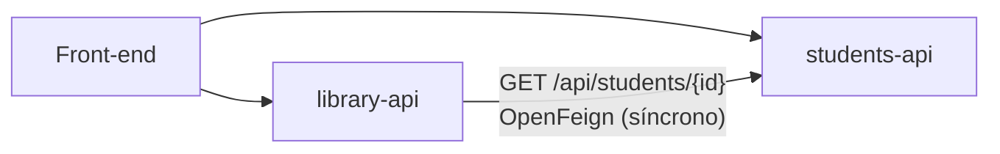
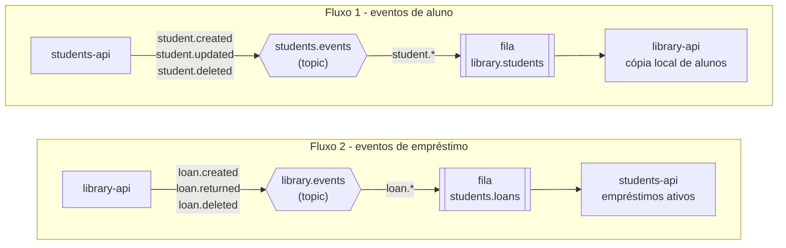
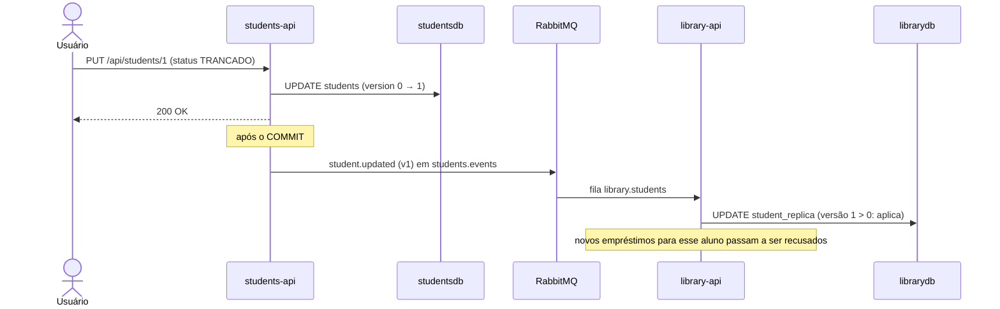
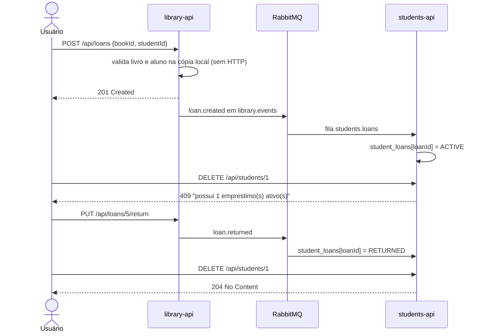
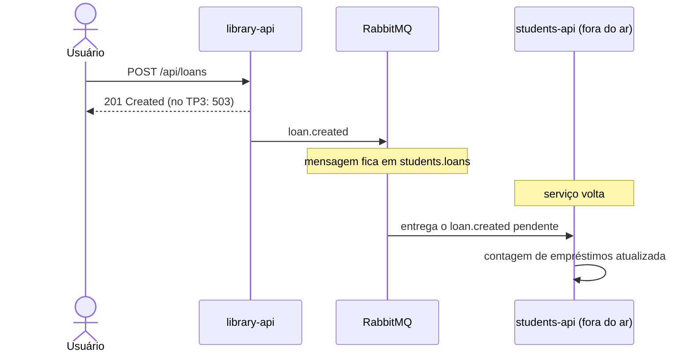

# Arquitetura orientada a eventos (TP4)

Detalhamento da refatoração feita no TP4, em que a comunicação síncrona entre a `library-api` e a `students-api` (OpenFeign) foi substituída por eventos no RabbitMQ. A visão geral do sistema está no [README principal](../README.md).

## Antes e depois

### TP3 - acoplamento síncrono

A `library-api` perguntava à `students-api`, por HTTP, cada vez que precisava de um aluno: ao criar um empréstimo (validar se existe e se está ativo) e em toda listagem de empréstimos (nome, matrícula e curso).



Consequências:

- **students-api fora do ar = empréstimos parados** (`503`), mesmo com o circuit breaker.
- Latência somada: cada criação de empréstimo esperava uma chamada remota.
- A `students-api` não sabia nada dos empréstimos - era possível excluir um aluno com livro em mãos.

### TP4 - comunicação por eventos

Nenhum serviço chama o outro. Cada um publica o que aconteceu no seu domínio e quem se interessa consome.



O front-end continua chamando cada API diretamente por HTTP; o que mudou é que as APIs não se chamam mais entre si.

| | TP3 (OpenFeign) | TP4 (RabbitMQ) |
|---|---|---|
| Como a library-api obtém o aluno | `GET` síncrono na students-api | Consulta a **cópia local** (`student_replica`), alimentada por eventos |
| students-api fora do ar | Empréstimo falha com `503` | Empréstimo funciona normalmente |
| library-api fora do ar | - | Eventos ficam **na fila** e são consumidos quando ela volta |
| Excluir aluno com empréstimo ativo | Permitido (empréstimo órfão) | Bloqueado com `409` - a students-api sabe dos empréstimos pelos eventos |
| Excluir livro com empréstimo ativo | Apagava os empréstimos em cascata | Bloqueado com `409` |
| Dependências | Spring Cloud OpenFeign + Resilience4j | `spring-boot-starter-amqp` |
| Consistência | Imediata (forte) | **Eventual** (milissegundos em operação normal) |

> No TP3 eu havia apontado o Eureka como próximo passo, para tirar a URL fixa do cliente Feign. Com a troca para mensageria a chamada síncrona entre os serviços deixou de existir e, com ela, a necessidade de descoberta de serviços: cada serviço só conhece o endereço do broker.

## Arquitetura orientada a eventos: prós, contras e quando usar

### Prós

- **Desacoplamento temporal:** produtor e consumidor não precisam estar no ar ao mesmo tempo. Foi o ganho mais visível aqui - a biblioteca continua emprestando livros com a `students-api` desligada.
- **Desacoplamento de conhecimento:** a `students-api` publica em uma exchange sem saber quem consome. Um novo serviço (notificações, relatórios) pode se inscrever em `student.*` sem alterar nenhuma linha dela.
- **Resiliência:** a falha de um serviço fica isolada nele; as mensagens esperam na fila (durável) em vez de virarem erro para o usuário.
- **Escalabilidade:** várias instâncias do mesmo consumidor dividem a fila entre si (competing consumers), sem balanceador de carga nem service discovery.
- **Menor latência nas operações:** criar um empréstimo virou uma operação 100% local.
- **Histórico natural:** os eventos descrevem o que aconteceu no domínio, o que facilita auditoria e integração com outros sistemas.

### Contras

- **Consistência eventual:** a cópia local fica um instante atrás da origem. Se um aluno for trancado e um empréstimo for criado no mesmo milissegundo, o empréstimo passa. No TP3 isso não acontecia.
- **Mais infraestrutura:** o broker vira uma peça crítica que precisa ser operada, monitorada e mantida disponível.
- **Complexidade de entrega:** é preciso lidar com mensagens duplicadas, fora de ordem ou perdidas - daí a idempotência e o controle de versão descritos em [Garantias](#garantias-de-consistência).
- **Depuração mais difícil:** um fluxo de negócio passa por vários processos e pela fila; rastrear o caminho exige logs correlacionados ou tracing distribuído.
- **Dados duplicados:** a `library-api` guarda uma cópia dos alunos, que ocupa espaço e precisa ser mantida.
- **Contratos implícitos:** o formato do evento é um contrato entre serviços. Mudar um campo sem cuidado quebra os consumidores sem erro de compilação.

### Quando vale a pena

- Quando **vários serviços reagem ao mesmo fato** (aluno cadastrado, pedido pago) e o produtor não deveria conhecê-los.
- Quando a **disponibilidade importa mais que a consistência imediata** - como aqui: é melhor emprestar o livro com o dado do aluno de alguns milissegundos atrás do que recusar o empréstimo.
- Para **processamento assíncrono ou pesado** (e-mails, relatórios, integrações lentas) que não precisa travar a resposta ao usuário.
- Para **absorver picos de carga**: a fila funciona como amortecedor entre quem produz e quem processa.

Quando **não** vale: operações que exigem resposta imediata e consistente (por exemplo, confirmar saldo antes de um pagamento), sistemas pequenos com um único serviço, ou equipes sem estrutura para operar o broker.

## Padrões de mensagens

| Padrão | Onde | Caso de uso |
|---|---|---|
| **Publish/Subscribe com topic exchange + Event-Carried State Transfer** | `students-api` → `students.events` → `library-api` | O evento carrega o estado completo do aluno; a `library-api` monta a própria cópia sem precisar chamar a origem de volta. |
| **Event Notification** | `library-api` → `library.events` → `students-api` | O evento só avisa que um empréstimo foi criado, devolvido ou removido; a `students-api` usa isso para manter a contagem de empréstimos ativos por aluno e aplicar a regra de exclusão. |

Os dois fluxos usam **topic exchanges**: o consumidor escolhe o que quer receber pela routing key (`student.*`, `loan.*`). Isso permite, por exemplo, criar outro consumidor só de `student.deleted` sem mexer nos existentes.

## Topologia no RabbitMQ

| Recurso | Tipo | Declarado por | Detalhe |
|---|---|---|---|
| `students.events` | Exchange topic, durável | as duas APIs | Recebe os eventos de aluno |
| `library.events` | Exchange topic, durável | as duas APIs | Recebe os eventos de empréstimo |
| `library.students` | Fila durável | `library-api` | Binding `students.events` → `student.*` |
| `students.loans` | Fila durável | `students-api` | Binding `library.events` → `loan.*` |

Cada consumidor declara **a própria fila** e o próprio binding; o produtor declara apenas a exchange. Filas duráveis e mensagens persistentes (padrão do `RabbitTemplate`) sobrevivem a reinícios do broker.

## Catálogo de eventos

### Eventos de aluno - `students.events`

| Routing key | Quando | Versão |
|---|---|---|
| `student.created` | Aluno cadastrado | `0` |
| `student.updated` | Aluno alterado, ou curso dele renomeado | valor do `@Version` após o update |
| `student.deleted` | Aluno removido | última versão + 1 |

```json
{
  "eventId": "f5c33441-5c7c-41b3-bff7-3c60ddc988f0",
  "type": "CREATED",
  "occurredAt": "2026-09-27T20:30:27.968107900Z",
  "studentId": 8,
  "version": 0,
  "name": "Joao Souza",
  "email": "joao.souza@infnet.edu.br",
  "enrollmentNumber": "2026002",
  "status": "ATIVO",
  "courseId": 2,
  "courseName": "Ciencia de Dados"
}
```

### Eventos de empréstimo - `library.events`

| Routing key | Quando |
|---|---|
| `loan.created` | Empréstimo registrado |
| `loan.returned` | Livro devolvido |
| `loan.deleted` | Registro de empréstimo removido |

```json
{
  "eventId": "0b8f5a52-2f8e-4c35-9d6c-7c4f1f0b1a11",
  "type": "CREATED",
  "occurredAt": "2026-09-27T21:00:00Z",
  "loanId": 5,
  "studentId": 2,
  "bookId": 1,
  "bookTitle": "Clean Architecture",
  "dueDate": "2026-10-11"
}
```

Todas as mensagens trafegam em JSON (`content_type: application/json`) e levam o `eventId` também no `message_id` da mensagem AMQP.

## Fluxos de eventos

### Cadastro ou alteração de aluno



### Empréstimo e contagem de empréstimos ativos



### Serviço fora do ar



## Garantias de consistência

| Problema | Como foi tratado |
|---|---|
| Publicar evento de algo que sofreu rollback | Os services registram o evento com `ApplicationEventPublisher`; o envio ao RabbitMQ acontece em um `@TransactionalEventListener(phase = AFTER_COMMIT)`. Sem commit, nada é publicado. |
| Broker fora do ar no momento da publicação | A falha é registrada em log e não desfaz a operação já gravada. |
| Mensagem entregue duas vezes | Aplicar o mesmo evento de novo produz o mesmo estado (idempotência). |
| Eventos de aluno fora de ordem | Cada evento carrega a `version` do aluno (`@Version`); a `library-api` descarta versões menores que a que já tem. |
| `UPDATED` atrasado chegando depois do `DELETED` | A cópia não apaga a linha: marca `deleted = true` com a versão da remoção, então o update antigo é descartado e o aluno não "ressuscita". O nome continua disponível para o histórico dos empréstimos. |
| Eventos de empréstimo duplicados ou fora de ordem | A `students-api` guarda o estado de cada empréstimo por `loanId`, que só avança (`ACTIVE → RETURNED → DELETED`). Um `loan.created` repetido ou atrasado não reativa um empréstimo já devolvido - diferente de um contador `+1/-1`, que erraria. |
| Curso renomeado | O nome do curso vai dentro do evento do aluno; ao renomear um curso, a `students-api` republica os alunos dele. |

## Abstrações do Spring Boot usadas

| Abstração | Uso |
|---|---|
| `spring-boot-starter-amqp` | Autoconfiguração da conexão, `RabbitTemplate`, `RabbitAdmin` e containers de listener a partir de `spring.rabbitmq.*` |
| Beans `TopicExchange`, `Queue`, `Binding` (`ExchangeBuilder`, `QueueBuilder`, `BindingBuilder`) | Topologia declarada em código; o `RabbitAdmin` cria tudo no broker ao conectar |
| `RabbitTemplate.convertAndSend(exchange, routingKey, objeto)` | Publicação, com conversão automática para JSON |
| `@RabbitListener(queues = ...)` | Consumo, com o JSON convertido direto para o `record` do evento |
| `JacksonJsonMessageConverter` | Conversor JSON (Jackson 3, padrão no Boot 4) |
| `ApplicationEventPublisher` + `@TransactionalEventListener` | Publicação somente após o commit |

```java
@TransactionalEventListener(phase = TransactionPhase.AFTER_COMMIT)
public void publish(StudentEvent event) {
    rabbitTemplate.convertAndSend(MessagingConfig.STUDENTS_EXCHANGE, event.type().routingKey(), event, ...);
}

@RabbitListener(queues = MessagingConfig.STUDENTS_QUEUE)
public void onStudentEvent(StudentEvent event) {
    replicaService.apply(event);
}
```

Configuração (igual nas duas APIs, com valores padrão que batem com o `docker-compose.yml`):

```properties
spring.rabbitmq.host=${RABBITMQ_HOST:localhost}
spring.rabbitmq.port=${RABBITMQ_PORT:5672}
spring.rabbitmq.username=${RABBITMQ_USER:library}
spring.rabbitmq.password=${RABBITMQ_PASSWORD:library}
```
