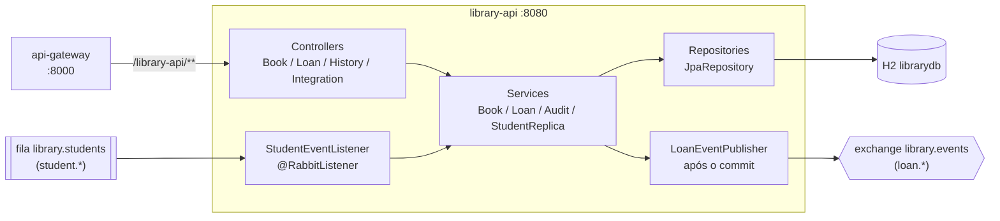
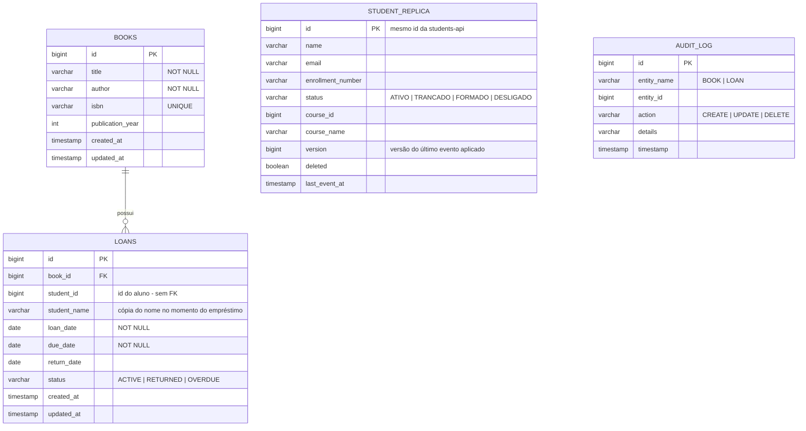

# Library API - Sistema de Biblioteca

API REST de gerenciamento de biblioteca desenvolvida na disciplina **Engenharia de Softwares Escaláveis** (Projeto de Bloco). A visão geral da arquitetura orientada a eventos está no [README da raiz](../README.md).

- **TP1** - Monólito simples com Spring Boot: arquitetura em camadas (controller → service → repository), API REST com Spring MVC e front-end React ([library-frontend](../library-frontend)).
- **TP2** - Camada de persistência real com **JPA + Spring Data**: mapeamento objeto-relacional, repositórios com consultas derivadas e `@Query`, **histórico de mudanças dos dados (auditoria)** e testes automatizados da camada de persistência.
- **TP3** - Extração do domínio de estudantes para um **microsserviço** ([students-api](../students-api)), integrado via Spring Cloud OpenFeign com circuit breaker.
- **TP4** - O Feign foi removido. A `library-api` passou a **consumir eventos de aluno** do RabbitMQ para manter uma **cópia local** dos estudantes e a **publicar eventos de empréstimo** para a `students-api`.
- **TP5** - PostgreSQL, Actuator, imagem Docker, rastreamento distribuído (Zipkin) e logs centralizados (Loki). Acessada pelo `api-gateway` na rota `/library-api/**`.

## Tecnologias

| Tecnologia | Uso |
|---|---|
| Java 21 / Spring Boot 4.1.0 | Base da aplicação (autoconfiguração, injeção de dependências) |
| Spring Web MVC | API REST (`@RestController`, `@GetMapping`, ...) |
| Spring Data JPA + Hibernate | Mapeamento objeto-relacional e repositórios |
| **Spring AMQP (`spring-boot-starter-amqp`)** | Publicação e consumo de eventos no RabbitMQ |
| Bean Validation (Jakarta) | Validação dos payloads de entrada |
| PostgreSQL 17 | Banco `librarydb` no Docker e no Kubernetes |
| H2 Database | Banco em memória para testes e execução local rápida |
| Spring Boot Actuator | Health, liveness e readiness |
| Micrometer Tracing + Zipkin | Rastreamento distribuído (inclusive através do RabbitMQ) |
| Loki4j (Logback) | Envio dos logs para o Loki |
| Lombok | Redução de boilerplate (`@Data`, construtores) |
| JUnit 5 + AssertJ + Mockito | Testes automatizados (`@DataJpaTest`, `@SpringBootTest`) |

## Arquitetura

Design em camadas, cada uma com responsabilidade única (SOLID). No TP4 entrou o pacote `messaging`, que conversa com o RabbitMQ e só chama a camada de serviço:

```
Controller  →  Service  →  Repository  →  Banco de dados (H2)
  (HTTP)      (regras de     (Spring Data JPA)
               negócio +
               auditoria)
                  ↑   ↓
             messaging (RabbitMQ)
   StudentEventListener   LoanEventPublisher
```



### O que mudou do TP3 para o TP4

| | TP3 (OpenFeign) | TP4 (eventos) |
|---|---|---|
| Dados do aluno | Buscados na `students-api` a cada uso | Lidos da tabela `student_replica`, alimentada por `student.created/updated/deleted` |
| Criar empréstimo com a `students-api` fora do ar | `503` | `201` |
| Listar empréstimos | Uma chamada HTTP para enriquecer a lista | Uma consulta local |
| Avisar a `students-api` sobre empréstimos | Não existia | Publica `loan.created/returned/deleted` em `library.events` |
| Excluir livro com empréstimo ativo | Apagava os empréstimos em cascata | `409` |
| Classes removidas | - | `StudentClient`, `StudentDto`, `CourseDto`, `StudentGateway`, `StudentServiceUnavailableException` |

## Mensageria

### Consumo: cópia local dos alunos

O [`StudentEventListener`](src/main/java/com/infnet/libraryapi/messaging/StudentEventListener.java) consome a fila `library.students` (ligada à exchange `students.events` pela routing key `student.*`) e entrega cada evento ao [`StudentReplicaService`](src/main/java/com/infnet/libraryapi/service/StudentReplicaService.java):

```java
@RabbitListener(queues = MessagingConfig.STUDENTS_QUEUE)
public void onStudentEvent(StudentEvent event) {
    replicaService.apply(event);
}
```

Regras aplicadas pelo `StudentReplicaService`:

| Situação | Tratamento |
|---|---|
| Evento com versão **maior** | Aplica e grava a nova versão |
| Mesma versão (entrega repetida, curso renomeado) | Aplica de novo; o resultado é o mesmo (idempotente) |
| Versão **menor** (chegou fora de ordem) | Descarta e registra em log |
| `student.deleted` | Não apaga a linha: marca `deleted = true`. Assim um `updated` atrasado não recria o aluno, e o nome continua disponível para o histórico dos empréstimos |

### Publicação: eventos de empréstimo

O `LoanService` registra um `LoanEvent` ao criar, devolver ou excluir um empréstimo. O [`LoanEventPublisher`](src/main/java/com/infnet/libraryapi/messaging/LoanEventPublisher.java) só envia ao RabbitMQ **depois do commit**:

```java
@TransactionalEventListener(phase = TransactionPhase.AFTER_COMMIT)
public void publish(LoanEvent event) {
    rabbitTemplate.convertAndSend(MessagingConfig.LIBRARY_EXCHANGE, event.type().routingKey(), event, ...);
}
```

Se a transação sofrer rollback (livro inexistente, aluno trancado), nenhum evento sai. Se o broker estiver fora do ar no momento do envio, a falha fica no log e o empréstimo continua gravado.

A topologia (exchanges, fila e binding) é declarada em [`MessagingConfig`](src/main/java/com/infnet/libraryapi/messaging/MessagingConfig.java). O catálogo completo dos eventos está no [README da raiz](../README.md#catálogo-de-eventos).

## Modelo de dados

O domínio da biblioteca foi modelado considerando os requisitos de consulta (buscas por título/autor/status, empréstimos em atraso, histórico por registro) e o isolamento do domínio. A tabela `students` saiu deste banco no TP3; no TP4 entrou a `student_replica`, uma **cópia somente leitura** mantida por eventos.

Banco **`librarydb`**:



### Por que `student_id` não é chave estrangeira

Cada serviço é dono do seu banco, então não existe FK atravessando a fronteira. Duas consequências deliberadas:

1. **A integridade sobe uma camada**: quem garante que o aluno existe e está `ATIVO` é o `LoanService`, consultando a `student_replica` antes de gravar.
2. **`student_name` é uma cópia proposital**: guardar o nome no momento do empréstimo mantém o histórico legível mesmo que o aluno ainda não tenha chegado na cópia local ou tenha sido removido depois.

### Mapeamento JPA

- `@Entity` + `@Table` transformam cada classe do domínio em tabela; `@Column` define restrições de integridade (`nullable`, `unique`, `length`).
- `@Id` + `@GeneratedValue(strategy = GenerationType.IDENTITY)` para livros, empréstimos e auditoria. A `StudentReplica` usa `@Id` **sem** geração, porque o id vem da `students-api`.
- Relacionamentos: `Loan` tem `@ManyToOne` + `@JoinColumn` para `Book` (FK `book_id`); o lado inverso usa `@OneToMany(mappedBy = ..., cascade = CascadeType.ALL)` com `@JsonIgnore` para evitar recursão na serialização JSON.
- `@Enumerated(EnumType.STRING)` grava os enums (`LoanStatus`, `AuditAction`) como texto legível no banco.
- `@EnableJpaAuditing` fica em [`JpaAuditingConfig`](src/main/java/com/infnet/libraryapi/config/JpaAuditingConfig.java), para que testes de fatia web não tentem inicializar o metamodelo JPA.

## Histórico de mudanças (auditoria e rastreabilidade)

Duas camadas complementares de rastreabilidade:

1. **Auditoria de datas (Spring Data JPA Auditing)**: toda entidade tem `createdAt` e `updatedAt` preenchidos automaticamente pelo `AuditingEntityListener` (`@CreatedDate`, `@LastModifiedDate`).
2. **Histórico consultável (`audit_log`)**: toda operação de escrita (CREATE, UPDATE, DELETE) feita pelos services gera um registro no `AuditService` com a entidade afetada, a ação e um detalhamento; em updates, o diff campo a campo (`title: 'Clean Code' -> 'Clean Code: A Handbook'`).

| Endpoint | Retorno |
|---|---|
| `GET /api/history` | Todo o histórico, mais recente primeiro |
| `GET /api/history/{entidade}` | Histórico de uma entidade (`BOOK`, `LOAN`) |
| `GET /api/history/{entidade}/{id}` | Histórico de um registro específico |

O histórico de `STUDENT` fica na `students-api` (`GET http://localhost:8000/students-api/api/history/STUDENT`). Cada serviço audita apenas o que é seu.

## Repositórios Spring Data - exemplos de uso

Os repositórios são interfaces que estendem `JpaRepository<Entidade, Long>` e herdam `save`, `findAll`, `findById`, `delete` etc. Consultas específicas usam **query methods derivados** e **`@Query`** (JPQL) quando a consulta é mais elaborada:

```java
// Query methods derivados
List<Book> findByTitleContainingIgnoreCase(String title);
List<Loan> findByStatus(LoanStatus status);
boolean existsByBookIdAndStatus(Long bookId, LoanStatus status);   // livro emprestado?

// cópia local dos alunos
Optional<StudentReplica> findByIdAndDeletedFalse(Long id);
List<StudentReplica> findByDeletedFalseOrderByNameAsc();

// JPQL com @Query - empréstimos ativos com devolução vencida
@Query("SELECT l FROM Loan l WHERE l.status = com.infnet.libraryapi.model.LoanStatus.ACTIVE AND l.dueDate < :date")
List<Loan> findOverdue(@Param("date") LocalDate date);
```

Uso na camada de serviço:

```java
// LoanService.create - o aluno vem da cópia local, sem chamada HTTP
var student = studentReplicaService.findById(request.studentId())
        .orElseThrow(() -> new BusinessException("Estudante %d nao encontrado".formatted(request.studentId())));

// LoanService.enrich - uma consulta para a lista inteira
Map<Long, StudentReplica> students = studentReplicaService.indexByIds(studentIds);
```

## Endpoints da API

| Método | Endpoint | Descrição |
|---|---|---|
| GET/POST | `/api/books` | Lista / cadastra livros |
| GET/PUT/DELETE | `/api/books/{id}` | Busca / atualiza / remove livro (`409` se houver empréstimo ativo) |
| GET | `/api/books/search/title/{title}` | Busca por título (parcial, sem caixa) |
| GET | `/api/books/search/author/{author}` | Busca por autor |
| GET/POST | `/api/loans` | Lista / cria empréstimos (publica `loan.created`) |
| GET/DELETE | `/api/loans/{id}` | Busca / remove empréstimo (publica `loan.deleted`) |
| PUT | `/api/loans/{id}/return` | Registra a devolução (publica `loan.returned`) |
| GET | `/api/loans/status/{status}` | Filtra por status (`ACTIVE`, `RETURNED`, `OVERDUE`) |
| GET | `/api/loans/student/{id}` / `/api/loans/book/{id}` | Empréstimos por aluno / livro |
| GET | `/api/loans/overdue` | Empréstimos ativos vencidos |
| GET | `/api/history[/{entidade}[/{id}]]` | Consulta o histórico de mudanças |

### Cópia local dos alunos (`/api/integration/students`)

Somente leitura. A `library-api` não é dona desses dados; escrita de aluno vai direto na `students-api` (:8081).

| Método | Endpoint | Descrição |
|---|---|---|
| GET | `/api/integration/students` | Alunos da cópia local (sem os removidos) |
| GET | `/api/integration/students/{id}` | Um aluno da cópia local, `404` se não existir |
| GET | `/api/integration/students/health` | Estado da cópia: `{ "source": "students.events", "studentCount": 4, "lastEventAt": "2026-09-27T21:39:15Z" }` |

### Contrato do empréstimo

```jsonc
// POST /api/loans - requisição
{ "bookId": 1, "studentId": 1 }

// resposta 201 - livro e datas do librarydb; nome, matrícula e curso da student_replica
{
  "id": 1,
  "bookId": 1, "bookTitle": "Clean Architecture", "bookAuthor": "Robert C. Martin",
  "studentId": 1, "studentName": "Maria Silva",
  "studentEnrollmentNumber": "2026001", "studentCourseName": "Engenharia de Software",
  "studentDataAvailable": true,
  "loanDate": "2026-09-27", "dueDate": "2026-10-11", "returnDate": null, "status": "ACTIVE"
}
```

`studentDataAvailable: false` indica que o aluno não está na cópia local; nesse caso o `studentName` é o nome copiado no próprio empréstimo.

### Exemplo de fluxo (curl)

```bash
# 1. Os alunos cadastrados na students-api chegam por evento
curl http://localhost:8000/library-api/api/integration/students/health
# {"source":"students.events","studentCount":4,"lastEventAt":"..."}

# 2. Cadastrar livro e criar empréstimo (validado na cópia local)
curl -X POST http://localhost:8000/library-api/api/books -H "Content-Type: application/json" \
  -d '{"title":"Clean Architecture","author":"Robert C. Martin","isbn":"9780134494166","publicationYear":2017}'
curl -X POST http://localhost:8000/library-api/api/loans -H "Content-Type: application/json" -d '{"bookId":1,"studentId":1}'

# 3. Devolver e consultar o histórico local
curl -X PUT http://localhost:8000/library-api/api/loans/1/return
curl http://localhost:8000/library-api/api/history/LOAN/1
```

Cenários de erro e de falha:

```bash
# Aluno trancado -> 409 (validado localmente)
curl -X POST http://localhost:8000/library-api/api/loans -H "Content-Type: application/json" -d '{"bookId":1,"studentId":4}'
# {"status":409,"message":"O estudante 'Pedro Santos' esta com situacao TRANCADO e nao pode pegar livros emprestados"}

# Aluno que não está na cópia local -> 409
curl -X POST http://localhost:8000/library-api/api/loans -H "Content-Type: application/json" -d '{"bookId":1,"studentId":999}'
# {"status":409,"message":"Estudante 999 nao encontrado"}

# Livro com empréstimo ativo -> 409
curl -X DELETE http://localhost:8000/library-api/api/books/1

# Com a students-api DERRUBADA o empréstimo continua funcionando (no TP3 era 503)
curl -X POST http://localhost:8000/library-api/api/loans -H "Content-Type: application/json" -d '{"bookId":2,"studentId":2}'
```

## Banco de dados

O banco é definido por variáveis de ambiente, com o H2 em memória como padrão:

| Variável | Padrão (local e testes) | Docker / Kubernetes |
|---|---|---|
| `DB_URL` | `jdbc:h2:mem:librarydb` | `jdbc:postgresql://library-db:5432/librarydb` |
| `DB_USER` / `DB_PASSWORD` | `sa` / vazio | usuário e senha do PostgreSQL |
| `SHOW_SQL` | `true` | `false` |
| `H2_CONSOLE` | `true` (`http://localhost:8080/h2-console`) | `false` |

O driver e o dialeto são detectados pela URL. O Hibernate cria e atualiza as tabelas a partir das entidades (`spring.jpa.hibernate.ddl-auto=update`).

No PostgreSQL os dados persistem entre reinícios, inclusive a cópia local dos alunos (`student_replica`).

## Como executar

**Pelo compose, com o sistema completo** (na raiz do repositório):

```bash
docker compose up -d --build
```

O serviço fica acessível pelo gateway em `http://localhost:8000/library-api`.

**Local, fora de contêiner** (H2 em memória e o RabbitMQ do compose):

```bash
docker compose up -d rabbitmq
./mvnw spring-boot:run     # http://localhost:8080
```

**Imagem Docker:** [`Dockerfile`](Dockerfile) multi-stage (build com JDK 21 e Maven Wrapper; runtime só com o JRE 21 e o jar, usuário sem privilégios). No pipeline a imagem é publicada em `ghcr.io/gustacassel/library-api`.

Variáveis do broker: `RABBITMQ_HOST`, `RABBITMQ_PORT`, `RABBITMQ_USER`, `RABBITMQ_PASSWORD` (padrão `localhost:5672`, `library/library`).

## Observabilidade

- **Health:** `/actuator/health` (inclui banco e RabbitMQ), `/actuator/health/liveness` e `/actuator/health/readiness`, usados pelo healthcheck do compose e pelas probes do Kubernetes.
- **Tracing:** cada requisição HTTP e cada mensagem publicada ou consumida gera spans no Zipkin (`ZIPKIN_ENABLED=true`, `ZIPKIN_URL`). O contexto do trace viaja nos headers AMQP, então o trace continua no outro serviço.
- **Logs:** com o perfil `loki` (`SPRING_PROFILES_ACTIVE=loki`, `LOKI_URL`) o [`logback-spring.xml`](src/main/resources/logback-spring.xml) envia os logs ao Loki com as etiquetas `app=library-api` e `level`, e com `traceId` e `spanId` em cada linha.

## Testes automatizados

```bash
./mvnw test     # 38 testes
```

| Teste | Tipo | O que cobre |
|---|---|---|
| `BookRepositoryTest` | `@DataJpaTest` | CRUD, query methods derivados, `createdAt`/`updatedAt` automáticos |
| `LoanRepositoryTest` | `@DataJpaTest` | `@ManyToOne` com `Book`, `student_id` sem FK, filtro por status e JPQL de atrasados |
| `AuditLogRepositoryTest` | `@DataJpaTest` | Timestamp automático e consultas do histórico |
| `DataHistoryIntegrationTest` | `@SpringBootTest` | Cada escrita gera histórico consultável, com diff no UPDATE |
| `StudentReplicaServiceTest` | `@SpringBootTest` | Cópia local: inserção, versões novas, eventos fora de ordem, entrega duplicada, curso renomeado, marcação de removido |
| `LoanStudentValidationTest` | `@SpringBootTest` | Empréstimo validado pela cópia local: aluno ativo, inexistente, trancado por evento, removido por evento; nome atualizado nos empréstimos existentes |
| `LoanEventPublishingTest` | `@SpringBootTest` + `@RecordApplicationEvents` | Evento para cada etapa do empréstimo, nenhum evento em operação recusada, routing key, falha do broker não propaga, bloqueio de exclusão de livro emprestado |
| `StudentEventListenerTest` | Unitário (Mockito) | Delegação ao service e leitura do JSON no formato publicado pela `students-api` |
| `LibraryapiApplicationTests` | `@SpringBootTest` | Carga do contexto |

Os testes não precisam do RabbitMQ: os listeners ficam desligados (`spring.rabbitmq.listener.simple.auto-startup=false`) e o `RabbitTemplate` é mockado onde a publicação é verificada. O arquivo [`src/test/resources/spring.properties`](src/test/resources/spring.properties) desliga a pausa de contextos do Spring 7, que religaria os listeners ao reaproveitar um contexto em cache.
