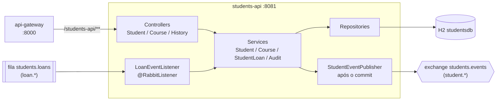
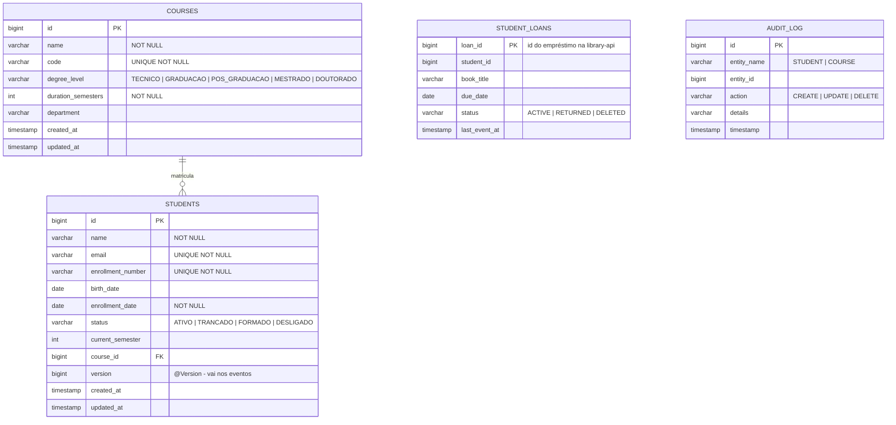

# Students API - Microsserviço de Estudantes e Cursos

Microsserviço criado no **TP3** da disciplina *Engenharia de Softwares Escaláveis*. Ele contém o domínio de **estudantes** que antes vivia dentro do monólito [`library-api`](../library-api), extraído para um serviço independente, com **banco próprio** e **ciclo de vida próprio**. A visão geral da arquitetura está no [README da raiz](../README.md).

> Além do cadastro de estudante, o serviço tem um segundo agregado, **Curso**, para que a separação faça sentido de verdade: o microsserviço é dono de um pedaço coeso do negócio (a vida acadêmica do aluno), e não apenas de uma tabela.

No **TP4** o serviço passou a se comunicar por eventos:

- **publica** `student.created`, `student.updated` e `student.deleted` na exchange `students.events`, que a `library-api` usa para manter a própria cópia dos alunos;
- **consome** os eventos de empréstimo da `library-api` (`library.events`) para saber quantos empréstimos ativos cada aluno tem, e **bloqueia a exclusão** de quem ainda tem livro em mãos.

No **TP5** ganhou PostgreSQL, Actuator, imagem Docker, rastreamento distribuído (Zipkin) e logs centralizados (Loki), e passou a ser acessada pelo `api-gateway` na rota `/students-api/**`.

## Papel na arquitetura



**Regra de ouro da separação:** este serviço é o **dono único** dos dados de estudante. A `library-api` não chama mais este serviço: ela mantém uma cópia somente leitura alimentada pelos eventos publicados aqui.

## Tecnologias

| Tecnologia | Uso |
|---|---|
| Java 21 / Spring Boot 4.1.0 | Base do microsserviço |
| Spring Web MVC | API REST |
| Spring Data JPA + Hibernate | Persistência e repositórios |
| **Spring AMQP (`spring-boot-starter-amqp`)** | Publicação e consumo de eventos no RabbitMQ |
| Bean Validation (Jakarta) | Validação dos payloads de entrada |
| PostgreSQL 17 | Banco `studentsdb` no Docker e no Kubernetes |
| H2 Database | Banco em memória para testes e execução local rápida |
| Spring Boot Actuator | Health, liveness e readiness |
| Micrometer Tracing + Zipkin | Rastreamento distribuído (inclusive através do RabbitMQ) |
| Loki4j (Logback) | Envio dos logs para o Loki |
| Lombok | Redução de boilerplate |
| JUnit 5 + AssertJ + Mockito | Testes automatizados |

## Mensageria

### Publicação: eventos de aluno

`StudentService` e `CourseService` registram um [`StudentEvent`](src/main/java/com/infnet/studentsapi/messaging/StudentEvent.java) a cada alteração. O [`StudentEventPublisher`](src/main/java/com/infnet/studentsapi/messaging/StudentEventPublisher.java) envia ao RabbitMQ somente **depois do commit**:

```java
@TransactionalEventListener(phase = TransactionPhase.AFTER_COMMIT)
public void publish(StudentEvent event) {
    rabbitTemplate.convertAndSend(MessagingConfig.STUDENTS_EXCHANGE, event.type().routingKey(), event, ...);
}
```

| Operação | Evento | Versão enviada |
|---|---|---|
| Cadastrar aluno | `student.created` | `0` |
| Alterar aluno | `student.updated` | valor do `@Version` após o update |
| Renomear curso | `student.updated` para cada aluno do curso | versão atual de cada aluno |
| Excluir aluno | `student.deleted` | última versão + 1 |

O evento carrega o estado completo do aluno (nome, matrícula, situação, curso). O consumidor monta a própria cópia sem precisar chamar este serviço, e usa a `version` para ignorar eventos que chegam fora de ordem. Operações recusadas (email duplicado, curso inexistente) não publicam nada, porque a transação não chega ao commit.

### Consumo: empréstimos ativos

O [`LoanEventListener`](src/main/java/com/infnet/studentsapi/messaging/LoanEventListener.java) consome a fila `students.loans` (ligada a `library.events` pela routing key `loan.*`). O [`StudentLoanService`](src/main/java/com/infnet/studentsapi/service/StudentLoanService.java) guarda o estado de cada empréstimo pelo `loanId`, e esse estado só avança:

```
ACTIVE  →  RETURNED  →  DELETED
```

Isso torna o consumo seguro contra entregas duplicadas e fora de ordem: um `loan.created` repetido ou atrasado nunca reativa um empréstimo já devolvido. Um simples contador `+1 / -1` erraria nesses casos.

Com essa informação:

- o aluno ganhou o campo **`activeLoans`** nas respostas da API (calculado com `@Formula`);
- `DELETE /api/students/{id}` responde **`409`** se o aluno tiver empréstimo ativo.

A topologia está em [`MessagingConfig`](src/main/java/com/infnet/studentsapi/messaging/MessagingConfig.java).

## Modelo de dados

Banco **`studentsdb`**, totalmente independente do banco da biblioteca.



O `status` do estudante não é decorativo: é ele que a `library-api` usa, pela cópia local, para decidir se o aluno pode pegar um livro emprestado. Só quem está **`ATIVO`** consegue.

### Mapeamento JPA

- `@Entity` + `@Table`, `@Id` + `@GeneratedValue(IDENTITY)` e `@Column` com `nullable`/`unique`/`length`, mesmas convenções do TP2. `StudentLoan` usa `@Id` sem geração, porque o id vem da `library-api`.
- `Student` → `Course` é `@ManyToOne` + `@JoinColumn(name = "course_id")`; o lado inverso (`Course.students`) usa `@OneToMany(mappedBy = "course")` com `@JsonIgnore`.
- `@Version` em `Student` controla a versão enviada nos eventos.
- `@Formula` em `Student.activeLoans` conta os empréstimos ativos com uma subconsulta em `student_loans`.
- `@Enumerated(EnumType.STRING)` grava `StudentStatus`, `DegreeLevel`, `StudentLoanStatus` e `AuditAction` como texto.
- `@EntityListeners(AuditingEntityListener.class)` + `@CreatedDate`/`@LastModifiedDate` preenchem `createdAt`/`updatedAt`. O `@EnableJpaAuditing` fica em [`JpaAuditingConfig`](src/main/java/com/infnet/studentsapi/config/JpaAuditingConfig.java), para que os testes `@WebMvcTest` não tentem inicializar o metamodelo JPA.

## Repositórios Spring Data - exemplos de uso

```java
// Query methods derivados
Optional<Student> findByEnrollmentNumber(String enrollmentNumber);
List<Student> findByStatus(StudentStatus status);
List<Student> findByCourseId(Long courseId);
boolean existsByCourseId(Long courseId);
long countByStudentIdAndStatus(Long studentId, StudentLoanStatus status);   // StudentLoanRepository

// JPQL agregado - quantos alunos ativos cada curso tem, em uma única consulta
@Query("""
        SELECT s.course.id, COUNT(s)
        FROM Student s
        WHERE s.course IS NOT NULL AND s.status = com.infnet.studentsapi.model.StudentStatus.ATIVO
        GROUP BY s.course.id
        """)
List<Object[]> countActiveStudentsByCourse();
```

Uso na camada de serviço:

```java
// StudentService.delete - o aluno só sai se não tiver livro emprestado
var activeLoans = studentLoanService.countActive(id);
if (activeLoans > 0) {
    throw new BusinessException("Nao e possivel remover o aluno ...");
}

// CourseService.delete - o curso só sai se ninguém estiver matriculado nele
if (studentRepository.existsByCourseId(id)) {
    throw new BusinessException("Nao e possivel remover o curso ...");
}
```

## Endpoints da API

### Estudantes

| Método | Endpoint | Descrição |
|---|---|---|
| GET | `/api/students` | Lista todos os estudantes (com o curso aninhado e `activeLoans`) |
| GET | `/api/students/{id}` | Busca por id, `404` se não existir |
| GET | `/api/students/search/name/{name}` | Busca por nome (parcial, sem caixa) |
| GET | `/api/students/enrollment/{number}` | Busca por matrícula |
| GET | `/api/students/status/{status}` | Filtra por situação (`ATIVO`, `TRANCADO`, `FORMADO`, `DESLIGADO`) |
| GET | `/api/students/course/{courseId}` | Alunos de um curso |
| POST | `/api/students` | Cadastra: `201`, `400` (validação) ou `409` (email/matrícula duplicados). Publica `student.created` |
| PUT | `/api/students/{id}` | Atualiza: `200`, `404`, `400` ou `409`. Publica `student.updated` |
| DELETE | `/api/students/{id}` | Remove: `204`, `404` ou **`409` se houver empréstimo ativo**. Publica `student.deleted` |

### Cursos

| Método | Endpoint | Descrição |
|---|---|---|
| GET | `/api/courses` | Lista os cursos em ordem alfabética |
| GET | `/api/courses/summary` | Cursos **com a contagem de alunos ativos** |
| GET | `/api/courses/{id}` | Busca por id |
| GET | `/api/courses/code/{code}` | Busca por código (ex.: `ESW`) |
| GET | `/api/courses/level/{degreeLevel}` | Filtra por nível |
| POST | `/api/courses` | Cadastra: `201`, `400` ou `409` (código duplicado) |
| PUT | `/api/courses/{id}` | Atualiza. Se o nome mudar, republica os alunos do curso |
| DELETE | `/api/courses/{id}` | Remove, `409` se o curso ainda tiver alunos |

### Histórico de mudanças

| Método | Endpoint | Descrição |
|---|---|---|
| GET | `/api/history` | Todo o histórico do microsserviço, mais recente primeiro |
| GET | `/api/history/{entidade}` | Histórico de uma entidade (`STUDENT`, `COURSE`) |
| GET | `/api/history/{entidade}/{id}` | Histórico de um registro específico |

Cada microsserviço mantém o **seu próprio** `audit_log`, no seu próprio banco.

### Contrato de erro

Erros de negócio e de validação respondem em JSON com o campo `message`, que é o formato que o front-end lê:

```json
{ "status": 409, "error": "Conflict", "message": "Nao e possivel remover o aluno 'Maria Silva': ele possui 1 emprestimo(s) ativo(s) na biblioteca" }
```

## Exemplo de fluxo (curl)

```bash
# 1. Cadastrar um estudante (a library-api recebe student.created)
curl -X POST http://localhost:8000/students-api/api/students -H "Content-Type: application/json" \
  -d '{"name":"Carla Mendes","email":"carla@infnet.edu.br","enrollmentNumber":"2026010","status":"ATIVO","currentSemester":1,"courseId":1}'

# 2. Conferir que ele chegou na cópia local da library-api
curl http://localhost:8000/library-api/api/integration/students

# 3. Trancar a matrícula (a library-api passa a recusar empréstimos para ele)
curl -X PUT http://localhost:8000/students-api/api/students/5 -H "Content-Type: application/json" \
  -d '{"name":"Carla Mendes","email":"carla@infnet.edu.br","enrollmentNumber":"2026010","status":"TRANCADO","currentSemester":1,"courseId":1}'

# 4. Depois de um empréstimo na library-api, o aluno mostra activeLoans e não pode ser removido
curl http://localhost:8000/students-api/api/students/1          # "activeLoans": 1
curl -X DELETE http://localhost:8000/students-api/api/students/1  # 409

# 5. Histórico de mudanças do aluno
curl http://localhost:8000/students-api/api/history/STUDENT/5
```

## Banco de dados

O banco é definido por variáveis de ambiente, com o H2 em memória como padrão:

| Variável | Padrão (local e testes) | Docker / Kubernetes |
|---|---|---|
| `DB_URL` | `jdbc:h2:mem:studentsdb` | `jdbc:postgresql://students-db:5432/studentsdb` |
| `DB_USER` / `DB_PASSWORD` | `sa` / vazio | usuário e senha do PostgreSQL |
| `SHOW_SQL` | `true` | `false` |
| `H2_CONSOLE` | `true` (`http://localhost:8081/h2-console`) | `false` |

O driver e o dialeto são detectados pela URL. O Hibernate cria e atualiza as tabelas a partir das entidades (`spring.jpa.hibernate.ddl-auto=update`).

O [`DataSeeder`](src/main/java/com/infnet/studentsapi/config/DataSeeder.java) carrega 3 cursos e 4 alunos de exemplo quando o banco está vazio (desativado no perfil `test`). Esses cadastros passam pelo `StudentService`, então também geram `student.created`.

## Como executar

**Pelo compose, com o sistema completo** (na raiz do repositório):

```bash
docker compose up -d --build
```

O serviço fica acessível pelo gateway em `http://localhost:8000/students-api`.

**Local, fora de contêiner** (H2 em memória e o RabbitMQ do compose):

```bash
docker compose up -d rabbitmq
./mvnw spring-boot:run     # http://localhost:8081
```

**Imagem Docker:** [`Dockerfile`](Dockerfile) multi-stage (build com JDK 21 e Maven Wrapper; runtime só com o JRE 21 e o jar, usuário sem privilégios). No pipeline a imagem é publicada em `ghcr.io/gustacassel/students-api`.

Variáveis do broker: `RABBITMQ_HOST`, `RABBITMQ_PORT`, `RABBITMQ_USER`, `RABBITMQ_PASSWORD` (padrão `localhost:5672`, `library/library`).

## Observabilidade

- **Health:** `/actuator/health` (inclui banco e RabbitMQ), `/actuator/health/liveness` e `/actuator/health/readiness`, usados pelo healthcheck do compose e pelas probes do Kubernetes.
- **Tracing:** cada requisição HTTP e cada mensagem publicada ou consumida gera spans no Zipkin (`ZIPKIN_ENABLED=true`, `ZIPKIN_URL`). O contexto do trace viaja nos headers AMQP, então o trace continua no outro serviço.
- **Logs:** com o perfil `loki` (`SPRING_PROFILES_ACTIVE=loki`, `LOKI_URL`) o [`logback-spring.xml`](src/main/resources/logback-spring.xml) envia os logs ao Loki com as etiquetas `app=students-api` e `level`, e com `traceId` e `spanId` em cada linha.

## Testes automatizados

```bash
./mvnw test     # 47 testes
```

| Teste | Tipo | O que cobre |
|---|---|---|
| `StudentRepositoryTest` | `@DataJpaTest` | CRUD, relacionamento com `Course`, query methods, JPQL agregada e unicidade |
| `CourseRepositoryTest` | `@DataJpaTest` | CRUD, busca por código/nível, ordenação e código único |
| `AuditLogRepositoryTest` | `@DataJpaTest` | Timestamp automático e consultas do histórico |
| `StudentServiceIntegrationTest` | `@SpringBootTest` | Regras de negócio, histórico com diff, bloqueio de remoção de curso com alunos e resumo com contagem de ativos |
| `StudentControllerTest` | `@WebMvcTest` | Endpoints REST: curso aninhado, filtros, `201`/`204`/`404`, `400` e `409` |
| `StudentEventPublishingTest` | `@SpringBootTest` + `@RecordApplicationEvents` | Evento certo em cada operação, versão incrementando, republicação ao renomear curso, nenhum evento em operação recusada, **nada vai ao broker antes do commit** e envio após o commit |
| `StudentEventPublisherTest` | Unitário (Mockito) | Routing key de cada tipo de evento; falha do broker não propaga |
| `StudentLoanServiceTest` | `@SpringBootTest` | Contagem de empréstimos ativos, entrega duplicada, `created` depois de `returned`, `activeLoans` no aluno e bloqueio de exclusão |
| `LoanEventListenerTest` | Unitário (Mockito) | Leitura do JSON no formato publicado pela `library-api` e delegação ao service |
| `StudentsApiApplicationTests` | `@SpringBootTest` | Carga do contexto |

Os testes não precisam do RabbitMQ: os listeners ficam desligados (`spring.rabbitmq.listener.simple.auto-startup=false`), o `RabbitTemplate` é mockado onde a publicação é verificada e o [`src/test/resources/spring.properties`](src/test/resources/spring.properties) desliga a pausa de contextos do Spring 7.
